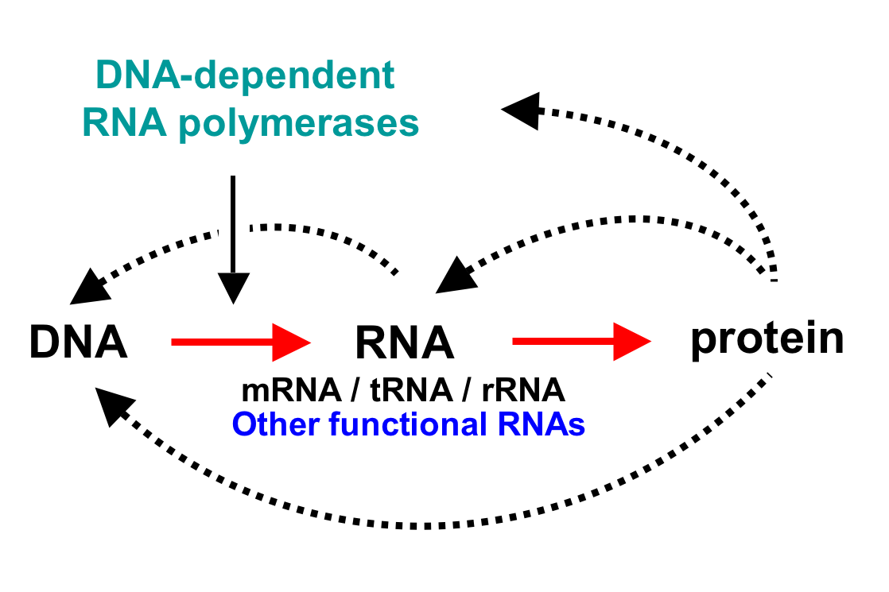
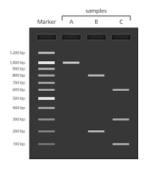
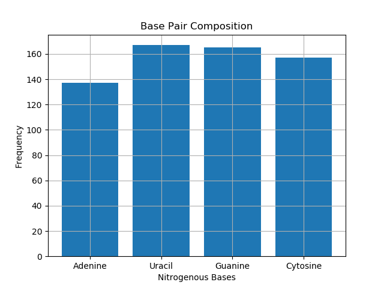
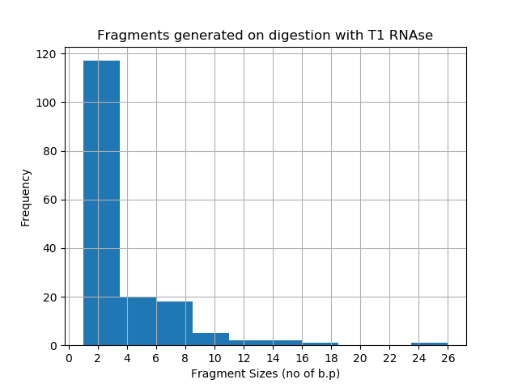
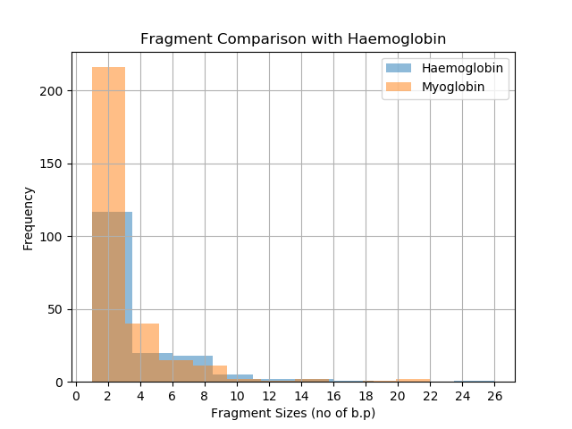
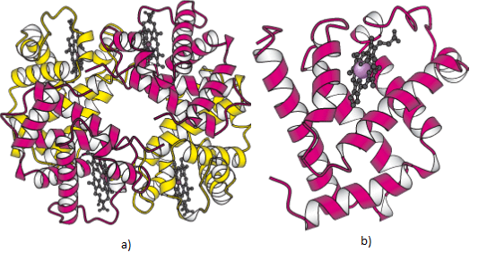
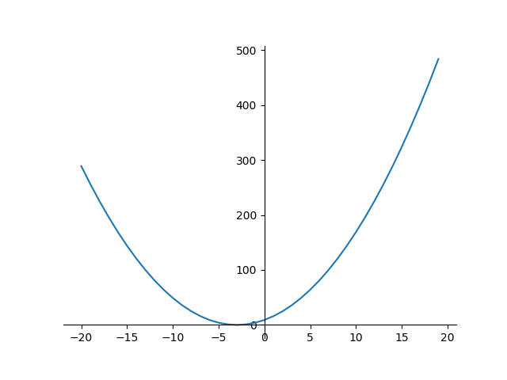
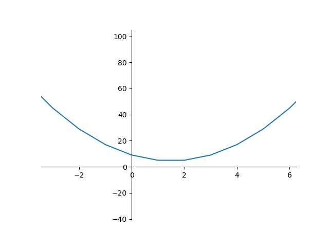

# NTUOSS-ScientificProgramming
_Workshop for AY2017-2018_

_Written by [Kunal Mishra](https://github.com/kunmishra2599) for [NTU Open Source Society](https://github.com/ntuoss)_

---
### Workshop Details:

When? Friday, 17 March 2018. 6:30 PM - 8:30 PM.

Where? LT13, North Spine, NTU

Who? NTU Open Source Society

### Pre-requisites:
- Python 3.x
- Comfy Clothes
- Dependencies:
   - Install them all through [Anaconda](https://www.anaconda.com/download/), which bundles a bunch of libraries for your use.
   - Or install them all in one go using pip. One of the following commands should work:
```
python -m pip install --user numpy scipy matplotlib ipython jupyter pandas sympy nose
pip install --user numpy scipy matplotlib ipython jupyter pandas sympy nose
pip3 install --user numpy scipy matplotlib ipython jupyter pandas sympy nose
```

### Workshop Overview
This workshop serves as an introduction to the SciPy stack. By using some relevant examples, I plan to introduce some concepts and demonstrate what the SciPy stack is capable of. Since I planned to keep the emphasis on the demonstration and the stack's abilty, the workshop isn't hard to follow through on, making it easier on you if you're a novice programmer.

---

## What is SciPy?
The SciPy stack is a collection of open source tools to help conduct scientific and mathematical computations for nearly any scientific purpose. It consists of numerous interdependent librares, such as:
- NumPy: a package for numerical computations
- Matplotlib: a package to aid data visualisation
- SymPy: a library for symbolic mathematics, designed to work hand in hand with NumPy
- Pandas: a package to aid data I/O and data analysis

_and much much more._ 

The stack also has integrations with [iPython](http://ipython.org/), an intelligent python shell and JuPyter. These are so useful in scientific computations that once you start using the shell you might never go back to the standard python shell. 

In this workshop, I'll cover some of the basics of NumPy, Matplotlib, and a little bit of SymPy to get you guys started. **Disclaimer:** this workshop is not intended to be an exhaustive tutorial. I'm attempting to cover just a bit of the basics of some of the modules in the stack, and hopefully guide you into learning more about the stack on your own. Comfy? Let's begin. 

## Section 1 - Some NumPy basics - Arrays, Indexing and Getting into the Matrix

Now, before we move any further, lets talk a bit about Numpy. It's one of the most useful libraries in python, adding support for arrays, matrices and poweful mathematical manipulation. Built in [2005](https://en.wikipedia.org/wiki/NumPy), it made running complex calculations in python much faster and easier with the help of built in functions. You'll find yourself using this library quite often soon, so it pays to know what it is (Throwback to Chait's workshop on [Machine Learning](https://github.com/chaitjo/NTUOSS-MachineLearningWorkshop)).

### Step 1 - What makes NumPy so great?
First, lets go through some NumPy basics. Lets start off simple. Create a file called `neo.py`, and inside it, add the following lines of code to import NumPy:

```python
import numpy as np
import timeit
```
Simple. Easy. Precise. I love python. Before we move on, `timeit` is a pretty useful function to, well, timeit. Basically it helps you time particular functions (which might not seem useful now but will be quite soon). 

I assume you guys know what a list is. Add the following lines of code to your program and lets begin:
```python
x = [2,5,10,394,420,50000,12309203920,5e+15]

def hellaMath(items):
    return (np.tan(items*np.sin(items)*np.cos(items)))**25
```

Now, using NumPy's built in functions, I've defined a function `hellaMath` that runs some calculations on elements of a list / array. You can find the whole list of built in Mathematical functions [here](https://docs.scipy.org/doc/numpy/reference/routines.math.html). Before we go further, I want to demonstrate NumPy's spectacular efficiency. Run the following line in your terminal:
```python
python -m timeit -v lambda:hellaMath(x)
```
Run it, and you should see something similar printed out below in the terminal(tbh, it depends on your PC and its processor, but here's what mine did at 1:30AM on 03/09/18 while I was listening to [Pink Floyd](https://www.youtube.com/watch?v=LTseTg48568) on youtube).
```python
10 loops -> 4.91e-06 secs
100 loops -> 3.7e-05 secs
1000 loops -> 0.000242 secs
10000 loops -> 0.0021 secs
100000 loops -> 0.0287 secs
1000000 loops -> 0.265 secs
raw times: 0.21 0.188 0.192
1000000 loops, best of 3: 0.188 usec per loop
```
Timeit does a series of loops as you can see, and averages out the time taken per loop, which is 0.188µsec per loop. 
_That's hella fast_. However, NumPy can do even better. 

Let's create an **array**. Now, I know people like to use the terms array and list interchangeably(I do too), but Python comes built in with Lists. NumPy adds array functionality to Python. Before we get into the differences, let's run the same test on a `Numpy.array`. Add the following lines to your code:
```python
y = np.array([2,5,10,394,420,50000,12309203920,5e+15])
```
And now, run this in the terminal:
```python
python -m timeit -v lambda:hellaMath(y)
```
Here's what my PC gave me:
```python
10 loops -> 1.51e-06 secs
100 loops -> 1.13e-05 secs
1000 loops -> 9.7e-05 secs
10000 loops -> 0.000709 secs
100000 loops -> 0.00641 secs
1000000 loops -> 0.0744 secs
10000000 loops -> 0.679 secs
raw times: 0.66 0.804 0.837
10000000 loops, best of 3: 0.066 usec per loop
```
0.066µseconds! That took nearly a third of the time! Noted, this is a rather simplistic example and doesn't like seem much, but when you work with larger functions and more complicated manipilation methods, microseconds add up to milliseconds, and milliseconds add up to seconds and so on.

What makes NumPy so fast? It's homogenised, so every element is of the same type. Try printing the variables `x` and `y` and you'll see the following output:
```python
x: [2, 5, 10, 394, 420, 50000, 12309203920, 5000000000000000.0]
y: [  2.00000000e+00   5.00000000e+00   1.00000000e+01   3.94000000e+02
      4.20000000e+02   5.00000000e+04   1.23092039e+10   5.00000000e+15]
```
Notice the difference? All NumPy elements are the same, and this makes calculations much faster and thus, more efficient. 

### Step 2 - Understand that NumPy is superior, and learn a bit more about it

While NumPy lets you create basic arrays like this:
```python
a1 = np.array([10,20,30])
```
It's true power comes from the fact that it lets you create **multidimensional arrays**. Like this:
```python
a2 = np.array([[10,20,30],[40,50,60],[70,80,90],[100,110,120]])
```
Which prints:
```python
[[ 10  20  30]
 [ 40  50  60]
 [ 70  80  90]
 [100 110 120]]
Shape:(4, 3)
```
Each Multidimensional array has a particular shape, which can be accessed from `yourarrayhere.shape`, which is in the format (Rows, Columns).
Array indexing is also quite similar to the way you'd index lists, with some twists. Take this example:
```python
print(a2[0,1])
20
print(a2[2,2])
90
print(a2[0,0],a2[1,1],a2[2,2])
10 50 90
print(a2[[0,1,2,3],[0,1,0,1]])
[ 10  50  70 110]
```
This gets a bit tricky to understand. Since `a2` is a multidimensional array, we have to specify the index for each row, and the for each element in the row. Therefore, to access `50`, you'd have to use `a2[1,1]`. Though this seems annoying now, it's quite powerful when you think about it. The last statement is a combination of the previous lines of code.
In essence, you can define an array of indices and use that to access data within the matrix.

Similar to lists, you can multiply arrays together, and this works element-wise. For example:
```python
a2*a2
[[  100   400   900]
 [ 1600  2500  3600]
 [ 4900  6400  8100]
 [10000 12100 14400]]
```
Every element multiplies by its counterpart with the same index. 

In addition to arrays, NumPy has amazing support for random number generation and sampling. For example, if you're working with particular distributions in statistics(F, T, Normal, etc.), NumPy lets you draw random samples from these particular descriptions for your use. Check out a whole list [here](https://docs.scipy.org/doc/numpy/reference/routines.random.html#distributions).

**Disclaimer:**

What I've given here is only a small subsection of what NumPy is truly capable of. You can check out the whole documentation [here](https://docs.scipy.org/doc/numpy/reference/index.html), and it is _fabulous_. Apologies for taking it really superficially, I've just intended for this workshop to give you guys an overview of the SciPy stack, so you can take it further by picking and choosing the libraries you need for your own projects! 

## Section 2 - Working with Matplotlib - Charts, Axes and Nucleotide Sequences

### Step 1 - Importing libraries and setting up the sequence
To start off, we need to import a few libaries for our use. Create a python file called `sequence.py`. Add the following lines to the top of your code:

```python
import matplotlib.pyplot as plt
from matplotlib.ticker import MultipleLocator, FormatStrFormatter
import numpy as np
```
Alot of these libraries will become relevant quite soon. The first import is for `pyplot`, which helps, you know, plot data. There are many different types of graphs you can plot, and you can check out a full list of them [here](https://matplotlib.org/tutorials/index.html).
The second `ticker` import will help us format the x and y axes on the graphs we're about to generate. The last imports the module `numpy`, which we'll get into soon. 

Following this, add the following line of code to your file:
```python
sequence="acauuugcuucugacacaacuguguucacuagcaaccucaaacagacaccauggugcaucugacuccugaggagaagucugccguuacugcccuguggggcaaggugaacguggaugaaguugguggugaggcccugggcaggcugcugguggucuacccuuggacccagagguucuuugaguccuuuggggaucuguccacuccugaugcuguuaugggcaacccuaaggugaaggcucauggcaagaaagugcucggugccuuuagugauggccuggcucaccuggacaaccucaagggcaccuuugccacacugagugagcugcacugugacaagcugcacguggauccugagaacuucaggcuccugggcaacgugcuggucugugugcuggcccaucacuuuggcaaagaauucaccccaccagugcaggcugccuaucagaaagugguggcugguguggcuaaugcccuggcccacaaguaucacuaagcucgcuuucuugcuguccaauuucuauuaaagguuccuuuguucccuaaguccaacuacuaaacugggggauauuaugaagggccuugagcaucuggauucugccuaauaaaaaacauuuauuuucauugc"
```
### Step 2 - Learning a bit of Molecular Biology
Now this is cool. This string is a **nucleotide sequence**, or more specifically, an **mRNA sequence**. mRNA stands for messenger Ribonucleic Acid (yes, it's a mouthful to say sometimes).

Running `print(len(sequence))` tells us that there are 626 base pairs in this sequence.

Before we proceed any further, let's address some basics. 

The image below illustrates the **Central Dogma of Molecular Biology**.


mRNA is made of four bases: Adenine, Uracil, Guanine, Cytosine.
mRNA sequence analysis reveals alot about the proteins that can be formed, and can be aided using tools such as [BLAST](https://blast.ncbi.nlm.nih.gov/Blast.cgi). Here, we're going to do a very simplistic analysis of nucleotide sequences using fragments and histograms, and hopefully learn a bit about `Matplotlib` and `Modern Scientific Techniques`. 

This particular mRNA sequence codes for the β subunit of Haemoglobin in Humans. Haemoglobin is a transport protein that helps bring oxygen around the body.

Now, generally, such sequences are unknown, and scientists probe the sequence using chemical and biological reagents to analyse the fragments generated and the size of the fragments. One such method is **Gel Electrophoresis**, an example of which is shown below:



### Step 3 - Doing a base pair analysis

To seperate the strand into fragments, we're going to mimic the activity of **RNAse T1**, a common endoribonuclease that quite literally, splices nucleotide sequences into fragments after Guanine Residues. Before we do that, lets visualise the base pair composition of the sequence. Add the following lines of code to your file:
```python
def bp_analysis(seq):

    counter = [0,0,0,0]
  
    for x in seq:
        if x == 'a':
            counter[0] += 1
        elif x == 'u':
            counter[1] += 1
        elif x == 'g':
            counter[2] += 1
        else:
            counter[3] += 1

    x_ax = np.arange(4)
  
    plt.bar(x_ax, counter)
    plt.xticks(x_ax, ('Adenine', 'Uracil', 'Guanine', 'Cytosine'))
    
    plt.xlabel('Nitrogenous Bases')
    plt.ylabel('Frequency')
    plt.title('Base Pair Composition')
    
    plt.grid(True)
    plt.show()
```
Ah, this piece of code serves as the first foray into `Matplotlib`.The first part of the code increases a `counter` everytime a particular base is encountered, giving us the following list: `[137, 167, 165, 157]`, in the following order: A, U, G, C. 
The line `x_ax` helps create a numpy array for each of our nitrogenous bases. 

The next line, `plt.bar(x_ax, counter)` calls the `bar()` function unto our data set, and the following line helps us define the labels for each of the bases. 
`Matplotlib` allows us quite a bit of formatting and modification options. The three lines demonstrate the simplicity of adding axis labels and a title to the graph. And finally, the last two lines help us to visualise the graph. Calling `bp_analysis(sequence)` generates the following graph. 



Yay! We've achieved liftoff. We can see roughly the composition of the four bases relative to each other. However, analytically speaking this doesn't give us much. The sequence shows that there's alot of Guanine residues present, but nothing whatsoever about the position of the residues. It could very well be `ggggggggggggggggggggggggggg`, `ggggggguuuuggguguguguguguug` or `aggagagagauuugag`.

We need to take this one step further and _cleave_ the mRNA sequence using our artificial RNAse T1. 

### Step 4 - Cleaving the sequence and analysing the fragments

Add the following lines of code to your file.
```python
def t1_digestion(seq):
    t1_pre_digested = seq.split('g')
    t1_digested = []
    for x in t1_pre_digested:
        if x == '':
            x = 'g'
            t1_digested.append(x)
        else:
            t1_digested.append(x)

    print('Digested fragments: '+ str(t1_digested))
    print('Number of Fragments: '+str(len(t1_digested)))

    plotme = []

    #getting fragment sizes
    for x in t1_digested:
        plotme.append(len(x))

    #plotting and formatting graph
    plt.xlabel('Fragment Sizes (no of b.p)')
    plt.ylabel('Frequency')
    plt.title('Fragments generated on digestion with T1 RNAse')

    minorLocator = MultipleLocator(2)
    majorLocator = MultipleLocator(2)
    majorFormatter = FormatStrFormatter('%d')

    ax = plt.subplot(111)

    ax.xaxis.set_major_locator(majorLocator)
    ax.xaxis.set_major_formatter(majorFormatter)

    ax.xaxis.set_minor_locator(minorLocator)
    plt.grid(True)
    plt.hist(plotme)
    plt.show()
```
These lines are quite similar to the previous function `bp_analysis`. Running `len(t1_digested)` tells us that there are a total of 166 digested fragments. Dividing the fragments by size, we can generate a histogram using `plt.hist`. The object of focus here, however is in these few lines:
```python
    minorLocator = MultipleLocator(2)
    majorLocator = MultipleLocator(2)
    majorFormatter = FormatStrFormatter('%d')

    ax = plt.subplot(111)

    ax.xaxis.set_major_locator(majorLocator)
    ax.xaxis.set_major_formatter(majorFormatter)

    ax.xaxis.set_minor_locator(minorLocator)
```
These let us format the major and minor 'ticks' on the graph generated. The `Locator` function defines how often a tick is placed, and in this case, it's every 2 units. The line `ax = plt.subplot(111)` creates a subplot, giving us access to more advanced formatting options in `Matplotlib`. The next few lines define the axis with the desired formatting options. 

Running `t1_digestion(sequence)` gives us the following graph:



This graph gives us a bit more information about the distribution of Guanine residues along the sequence. Most fragments are between 1-6 base pairs long, and most likely this means that guanine residues are distributed roughly quite evenly throughout the sequence. Now that we know some more information about this sequence, let's try visually comparing it against a sequence that codes for another protein: Myglobin.

### Step 5 - Unknown Protein Comparison

Add the following sequence to your file:
```python
myoglobin="aaaccccagcuguuggggccaggacacccagugagcccauacuugcucuuuuugucuucuucagacugcgccauggggcucagcgacggggaauggcaguuggugcugaacgucugggggaaguccucaucaggcucuuuaagggucacccagagacucuggagaaguuugacaaguucaagcaccugaagucagaggacgagaugaaggcaucugaggacuuaaagaagcauggugccacugugcucaccgcccuggguggcauccuuaagaagaaggggcaucaugaggcagagauuaagccccuggcacagucgcaugccaccaagcacaagauccccgugaaguaccuggaguucaucucggaaugcaucauccagguucugcagagcaagcaucccggggacuuuggugcugaugcccagggggccaugaacaaggcccuggagcuguuccggaaggacauggccuccaacuacaaggagcugggcuuccagggcuaggccccugccgcucccacccccacccaucugggccccggguucaagagagagcggggucugaucucguguagccauauagaguuugcuucugagugucugcuuuguuuaguagaggugggcaggaggagcugaggggcuggggcugggguguugaaguuggcuuugcaugcccagcgaugcgccucccugugggaugucaucacccugggaaccgggaguggcccuuggcucacuguguucugcaugguuuggaucugaauuaauuguccuuucuucuaaaucccaaccgaacuucuuccaaccuccaaacuggcuguaaccccaaauccaagccauuaacuacaccugacaguagcaauugucugauuaaucacuggccccuugaagacagcagaaugucccuuugcaaugaggaggagaucugggcugggcgggccagcuggggaagcauuugacuaucuggaacuugugugugccuccucaggt"
```
Through this exercise, we'll hopefully learn more about Myoglobin. ~~Well, I know about myoglobin, but this should help you guys learn more about it haha.~~ 
This sequence is 989 base pairs long. We'll skip on the base pair analysis and directly compare it against the known fragments from the Haemoglobin sequence.

Add this function to your code.
```python
def h_comparison(seq1, seq2):
    t1_pre_digested1 = seq1.split('g')
    t1_digested1 = []
    for x in t1_pre_digested1:
        if x == '':
            x = 'g'
            t1_digested1.append(x)
        else:
            t1_digested1.append(x)

    plotme1 = []

    for x in t1_digested1:
        plotme1.append(len(x))

    t1_pre_digested2 = seq2.split('g')
    t1_digested2 = []
    for x in t1_pre_digested2:
        if x == '':
            x = 'g'
            t1_digested2.append(x)
        else:
            t1_digested2.append(x)


    plotme2 = []


    for x in t1_digested2:
        plotme2.append(len(x))

    #plotting and formatting graph
    plt.xlabel('Fragment Sizes (no of b.p)')
    plt.ylabel('Frequency')
    plt.title('Fragment Comparison with Haemoglobin')

    minorLocator = MultipleLocator(2)
    majorLocator = MultipleLocator(2)
    majorFormatter = FormatStrFormatter('%d')

    ax = plt.subplot(111)

    ax.xaxis.set_major_locator(majorLocator)
    ax.xaxis.set_major_formatter(majorFormatter)

    ax.xaxis.set_minor_locator(minorLocator)
    plt.grid(True)
    plt.hist(plotme1, alpha=0.5, label='Haemoglobin')
    plt.hist(plotme2, alpha=0.5, label='Myoglobin')
    plt.legend(loc='upper right')

    plt.show()
```
This code isn't quite hard to make sense of actually. It performs the same operation on both the sequences and then plots them. Calling `h_comparison(sequence, myoglobin)` gives the following plot:



On analysing the graph, you can see that though the fragment frequencies are larger in Myoglobin(owing to the larger sequence length), the cleavage pattern is similar to Haemoglobin, and this tell us that the two proteins are quite similar in shape, and as it follows in molecular biology, function as well. In fact, both Haemoglobin and Myoglobin are oxygen transporters / storers. Myoglobin stores oxygen in muscles and has a very high affinity for Oxygen. The two proteins(I call them **H&M**) look like this:



Interesting? [Here](http://www.sbs.ntu.edu.sg/prospective/undergraduate/MinorinLifeSciences/Pages/Home.aspx)'s a link outlining the Life Sciences Minor at NTU(haha).

## Section 3 - Solving equations with SymPy
While calculations using Python's built in `math` module or SciPy's `numpy` module might work in most cases, sometimes having precise calculations, rather than approximations(for example, to the 10th decimal place) might not work. Imagine plotting the course of a rocket to Mars and relying on numerical data only accurate to the 10th decimal place! Taking into account wind, acceleration, mass and countless other factors, the rocket is most likely to, well...


Let's take some basic examples first. Create a file called `sim.py` and add the following lines of code to the file:
```python
import math
import sympy

x = math.sqrt(24)
y = sympy.sqrt(24)

print(x)
print(y)
```
Now try printing the variables x and y. You should see the following output:
```python
4.898979485566356
2*sqrt(6)
```
Woah! What happened there! The math module printed the the approximate result, which is what you'd get on plugging it in many calculators. But what did NumPy do exactly?
It printed the equivalent of this:
.

That's where SymPy's specificity comes from. If we were to use the value of x in another calculation, it would lead to errors somewhere along the the line. However, using SymPy's rationalisation of equations such as this, it increases the accuracy of your calculations by keeping it in this form, allowing smoother manipulation. 


This is the essence of SymPy. It tries to simplify calculations wherever possible to ensure smoother calculations. 
Let's take it one step further and try writing this expression in SymPy: .

Add the following lines of code to your file:
```python
a, b = sympy.symbols('a b')
e = 2*a + 4*a*b + 6*b**2
```
SymPy has a set of symbols, or variables we can import for use in our equations. It's as simple as defining variables programmatically in Python and making them equal to sympy's own symbols. Once that's done, you can use them in expressions, the way I've used them above. 
Now try adding this line of code:
```python
e-a
```
Normally, you'd expect the output to be `2*a + 4*a*b + 6*b**2 - a`, but SymPy is smarter. It prints this:
```python
4*a*b + a + 6*b**2
```
SymPy's run the calculation the way you'd expect algebra to work! And it's rearranged the equation too! In this way, you can run and specify particular algebraic statements in your programs and solve them programmatically too. Take this example:
```python
d = sympy.symbols('d')
solution1 = sympy.solve(d**2 + 6*d + 9)
print(solution1)
>>>[-3]
solution2 = sympy.solve(2*d**2 - 6*d + 9)
print(solution2)
>>>[3/2 - 3*I/2, 3/2 + 3*I/2]
```
This is cool. We've attempted to solve two equations:  and . Before we try looking into the solution, let's try plotting our graphs using our pal, Matplotlib.

In your file, `import numpy as np`, and add the following function to your file:
```
def graph(formula, data_range):
    x = np.array(data_range)
    y = eval(formula)
    
    ax = plt.gca()
    
    ax.spines['right'].set_color('none')
    ax.spines['top'].set_color('none')
    ax.xaxis.set_ticks_position('bottom')
    ax.spines['bottom'].set_position(('data',0))
    ax.yaxis.set_ticks_position('left')
    ax.spines['left'].set_position(('data',0))
    
    plt.plot(x, y)
    plt.show()

graph('x**2 + 6*x + 9', range(-20,20))
```
Most of this code is similar to the code used above in Section 2, and feel free to use this function in the future cause it makes graphing functions quick and convenient. This gives the following output:



As you can see, the graph intersets the x axis at -3, corresponding to the solution given above using SymPy. Running the function on our second expression, however, gives the following graph(after zooming in a little :) ):



The graph doesn't intersect the axis at all, and as anyone who's done algebra knows, this means the function has imaginary roots, as shown through the solution above through SymPy. 

This should show SymPy's capability. You can do much, much more, like evaluate limits, trigonometric expressions, simplify expressions and run integrals. Best of all, it has support for LATEX, so you could type a line in LATEX and it would evaluate it like any other expression. Check out a full list of things SymPy can do [here](http://docs.sympy.org/latest/index.html).

---
### That's all folks!

I understand that it's been a very superficial treatment of the stack, and you'll see soon that it's capable of _alot_ more, but in the interest of getting my point across, I've chosen to keep it quite simple and a bit basic. You can feel free to reach out in case of any doubts!

Special thanks to NTUOSS for letting me give this talk in the first place, and to the AY2017-2018 committee for their views on the workshop!

Cheers!

## Resources:
- SciPy's Homepage: https://scipy.org/
- NumPy Reference Documentation: https://docs.scipy.org/doc/numpy/reference/index.html
- Kuleshov and Caswell's CS228 Python tutorial (Really good for a quick refresher): https://github.com/kuleshov/cs228-material/blob/master/tutorials/python/cs228-python-tutorial.ipynb
- Matplotlib's Reference Documentation: https://github.com/kuleshov/cs228-material/blob/master/tutorials/python/cs228-python-tutorial.ipynb
- BLAST: https://blast.ncbi.nlm.nih.gov/Blast.cgi
- Haemoglobin and Myoglobin: https://www.quora.com/What-is-the-difference-between-hemoglobin-and-myoglobin-How-are-they-useful
- Structure and Function Relation of human haemoglobins (interesting paper, if you've got the time): https://www.ncbi.nlm.nih.gov/pmc/articles/PMC1484532/
- Guitar Inspiration: https://youtu.be/LTseTg48568?t=4m35s
- SymPy's documentation: http://docs.sympy.org/latest/index.html
